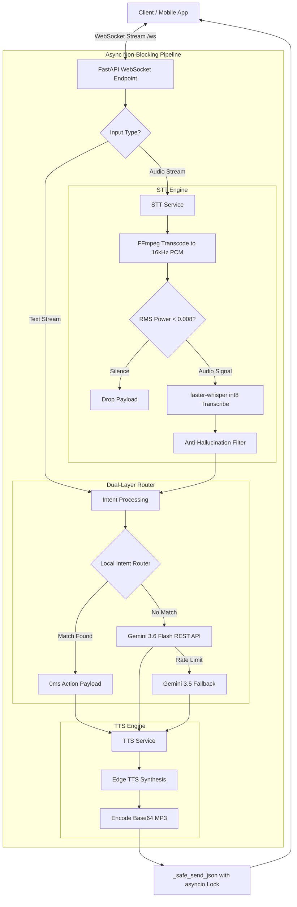

# 🤖 J.A.R.V.I.S. AI Backend

[](https://www.python.org/)
[](https://fastapi.tiangolo.com/)
[](https://ai.google.dev/)
[](https://github.com/SYSTRAN/faster-whisper)
[](LICENSE)

> **Real-time, ultra-low latency AI voice assistant and autonomous mobile controller backend.**  
> Powered by **FastAPI**, **WebSockets**, **faster-whisper (int8)**, **Edge-TTS**, and a **Hybrid Dual-Layer Intent Router** combining local zero-latency pattern matching with **Google Gemini 3.6 Flash**.

---

## ✨ Features

- ⚡ **Real-Time WebSocket Streaming (`/ws`)**: Full-duplex persistent audio/text streaming pipeline with non-blocking async event loop design and concurrent write locks (`send_lock`).
- 🎙️ **Optimized Speech-To-Text (STT)**:
  - Powered by `faster-whisper` with 8-bit quantization (`int8`) for 4x faster transcription.
  - In-memory C-level **FFmpeg** audio pipe decoding (zero disk I/O).
  - **RMS Energy Noise Gate**: Drops silence/static noise before invoking Whisper.
  - Anti-hallucination guardrails (`no_speech_threshold=0.6`, hallucination filtering).
- 🧠 **Hybrid Dual-Layer Intent Engine**:
  - **Layer 1 (Local Regex Router)**: Executes common hardware/app controls (`TORCH_ON`, `OPEN_YOUTUBE`, `VOLUME_UP`, `OPEN_APP`) in **0ms** without API quota consumption. Supports English and Hinglish phrases.
  - **Layer 2 (Gemini 3.6 Flash Fallback)**: Structured JSON reasoning for complex conversational queries.
- 🔊 **Base64 Streaming Text-To-Speech (TTS)**: Dynamic neural speech synthesis via `edge-tts` (Microsoft Edge Neural Voice) streamed directly into Base64 MP3 WebSocket payloads.
- 🔍 **Real-Time Web Search**: Integrated DuckDuckGo search service for live web information retrieval.

---

## 🏗️ Architecture Flow



---

## 🛠️ Supported System Actions

The backend emits structured JSON responses instructing the mobile/client device to perform local system control:

| Action Code | Description | Example Trigger |
| :--- | :--- | :--- |
| `TORCH_ON` | Turns on device flashlight | *"Turn on the torch"*, *"Flashlight jalao"* |
| `TORCH_OFF` | Turns off device flashlight | *"Flashlight off karo"* |
| `OPEN_YOUTUBE` | Launches YouTube app | *"Open YouTube"* |
| `OPEN_WHATSAPP` | Launches WhatsApp app | *"WhatsApp kholo"* |
| `OPEN_CAMERA` | Launches Camera app | *"Open camera"* |
| `OPEN_SETTINGS` | Opens Android settings | *"Open settings"* |
| `OPEN_INSTAGRAM` | Launches Instagram | *"Open Instagram"* |
| `OPEN_SPOTIFY` | Launches Spotify | *"Play Spotify"* |
| `OPEN_APP` | Opens any specific installed app | *"Open Telegram"*, *"Open Calculator"* |
| `SEARCH_GOOGLE` | Performs Google/Web search | *"Search for Python tutorials"* |
| `VOLUME_UP` | Increases media volume | *"Volume badhao"* |
| `VOLUME_DOWN` | Decreases media volume | *"Volume kam karo"* |
| `NONE` | Pure voice response / general Q&A | *"Who is Tony Stark?"* |

---

## 📁 Repository Structure

```
jarvis backend/
├── .env.example              # Environment variables template
├── .gitignore                # Git ignore rule definitions
├── config.py                 # Configuration loader (Pydantic BaseSettings)
├── main.py                   # FastAPI application & WebSocket connection lifecycle
├── test_tool_schema.py       # Pydantic schema validation tests
├── requirements.txt          # Dependencies manifest
└── services/
    ├── __init__.py           # Package marker
    ├── actions.py            # DeviceAction and BrainResponse Pydantic models
    ├── llm_service.py        # Local Regex Router & Gemini REST API integration
    ├── search_service.py     # DuckDuckGo search integration engine
    ├── stt_service.py        # Singleton faster-whisper STT engine & RMS gate
    └── tts_service.py        # Edge-TTS audio synthesis service
```

---

## ⚙️ Setup & Installation

### Prerequisites
- **Python 3.10+** installed.
- **FFmpeg** installed and added to your system `PATH`.
  - Windows: `choco install ffmpeg` or download from [ffmpeg.org](https://ffmpeg.org/).
  - Linux: `sudo apt install ffmpeg`

### 1. Clone Repository
```bash
git clone https://github.com/brijendray200/JARVIS-Ai-BACKEND.git
cd JARVIS-Ai-BACKEND
```

### 2. Set Up Virtual Environment
```bash
python -m venv .venv

# On Windows:
.venv\Scripts\activate

# On Linux/macOS:
source .venv/bin/activate
```

### 3. Install Dependencies
```bash
pip install -r requirements.txt
```

### 4. Environment Configuration
Create a `.env` file in the root directory:
```bash
cp .env.example .env
```
Fill in your configuration:
```env
GEMINI_API_KEY=your_actual_gemini_api_key_here
WHISPER_MODEL_SIZE=tiny
TTS_VOICE=en-IN-PrabhatNeural
HOST=0.0.0.0
PORT=8000
```

---

## 🚀 Running the Server

Start the development server with hot reloading:
```bash
python main.py
```
Or via `uvicorn` directly:
```bash
uvicorn main:app --host 0.0.0.0 --port 8000 --reload
```

The WebSocket server will be active at: `ws://localhost:8000/ws`

---

## 📡 WebSocket API Specification (`/ws`)

### 📩 Request Payload Format

A client can send either binary audio bytes or JSON payloads over WebSocket:

**Audio Stream (Base64 JSON)**:
```json
{
  "audio": "<base64_encoded_audio_bytes>"
}
```

**Text Input (JSON)**:
```json
{
  "text": "Turn on flashlight"
}
```

---

### 📤 Response Payload Format

```json
{
  "transcription": "turn on flashlight",
  "reply": "Right away, sir. Illuminating your path.",
  "action": "TORCH_ON",
  "query": "",
  "audio": "<base64_encoded_mp3_audio>"
}
```

---

## 📜 License

Distributed under the MIT License. See `LICENSE` for details.
